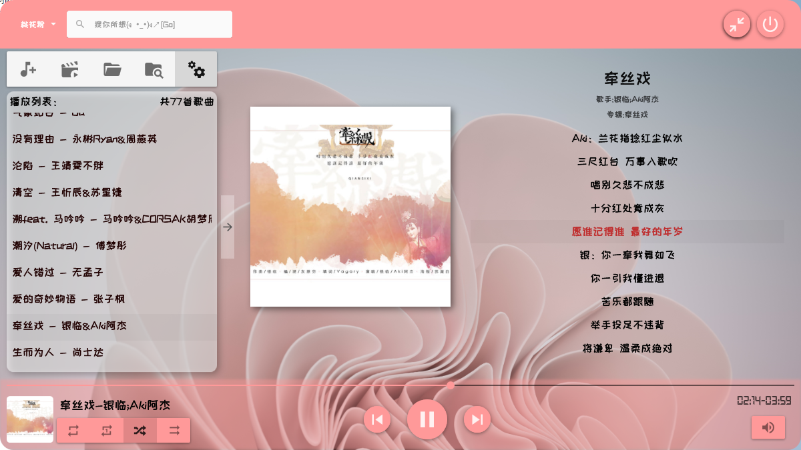
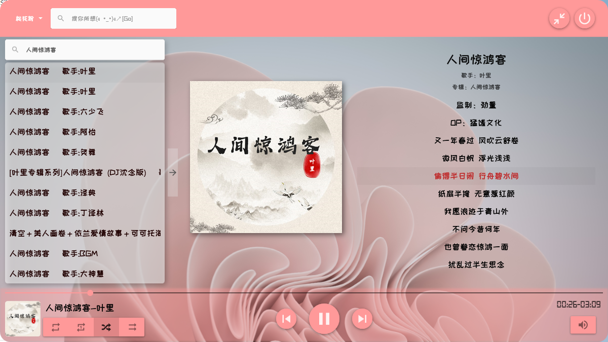
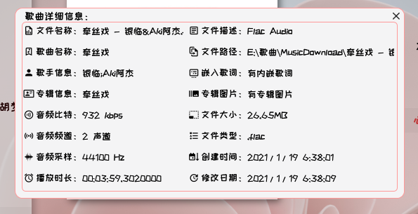
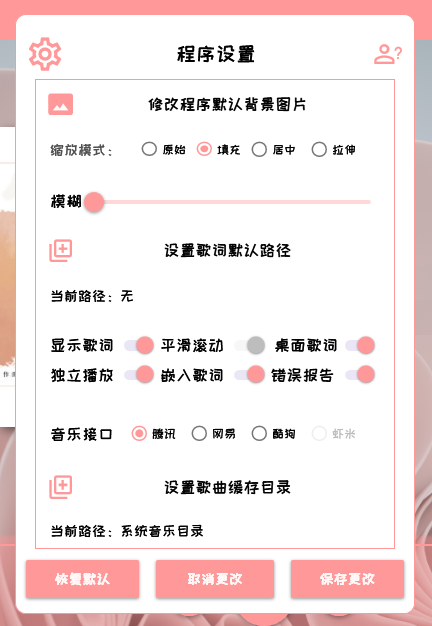

# **项目名称：方糖音乐播放器**

#### 项目简介：

一款本地化的多媒体播放器,采用C#语言开发，基于.NET 4.7.2框架，支持本地播放，在线播放两种模式，项目界面采用“MaterialDesignThemes”开源控件库开发，由于WPF底层采用DirectX渲染，程序中又使用的大量的动画效果建议在支持DirectX 12图形适配器上使用。较低的配置上可能会导致动画卡顿的情况。

#### 功能介绍：

1.支持添加媒体目录，打开媒体文件，自动扫描媒体文件三种添加方式。支持关键词搜索功能

2.能够自动读取媒体文件的标签信息，支持自定义歌词目录，支持读取内部嵌入歌词，自动搜寻歌词，和自动嵌入歌词(可选)功能。

3.支持歌词自动滚动，以及用户在调整进度后能够自动定位当前歌词，和选定歌词自动定位歌曲进度。

4.支持网络搜索在线播放功能，采用网络接口有“腾讯”、”网易“、”酷狗“、”虾米“，目前只支持在线播放，后期将加入下载、收藏等功能。

5.支持的播放模式有“列表循环”、“单曲循环”、“随机播放”、“顺序播放“四种播放模式

6.支持桌面歌词功能(需要在设置中打开)与歌曲歌词同步，支持”上一曲”、“下一曲”、“播放”、“暂停”等快捷操作。

7.程序提供了丰富的个性化功能，支持”主题颜色“，界面背景“，”背景模糊“，”缩放模式“等功能。

#### 界面截图：

##### 本地播放歌曲：

##### 在线播放歌曲：

##### 歌曲详细信息：

##### 程序设置：

##### 桌面歌词：

#### 引用及参考：

1.“MaterialDesignThemes” 用于主界面样式，控件UI设计

2.”taglib-sharp.dll “ 用于读取媒体的标签信息

3."Fody" 用于合成单exe文件

4.”Meting4Net“ 程序的联网播放框架，提供网络接口搜索功能

#### 写到最后：

编译后的exe文件：

蓝奏云：https://wwe.lanzoui.com/b01offuja  密码：gmoo

#### 温馨提示：

此项目仅供学习参考，存在一堆辣鸡代码，阅读代码请做好瞎眼准备

如果遇到项目无法生成的情况，可以尝试卸载项目后重新加载，或者尝试还原NuGet包

