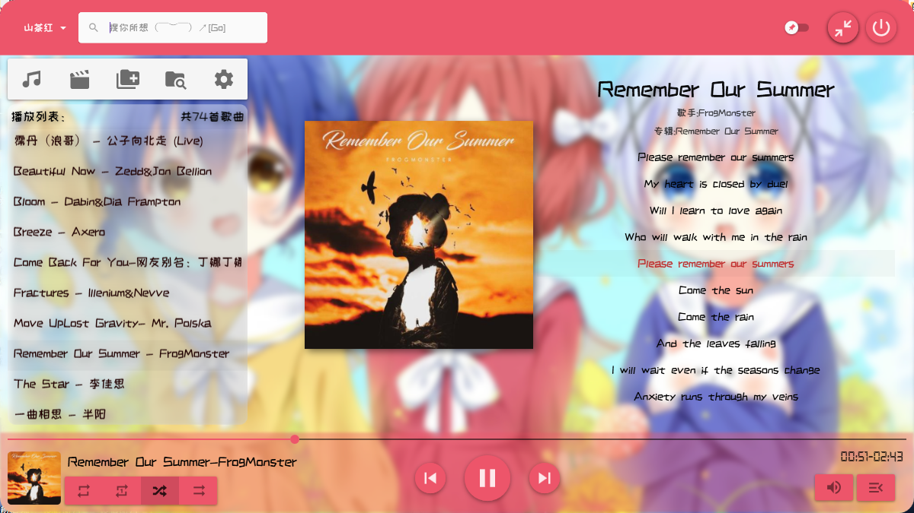
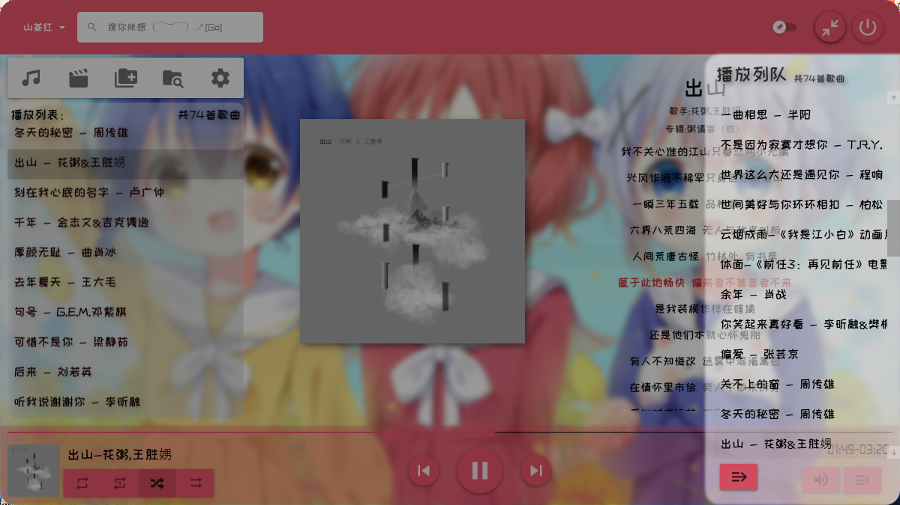
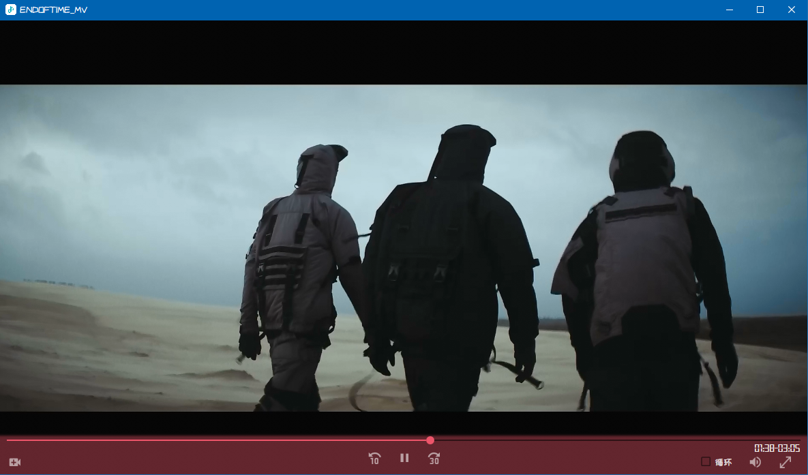
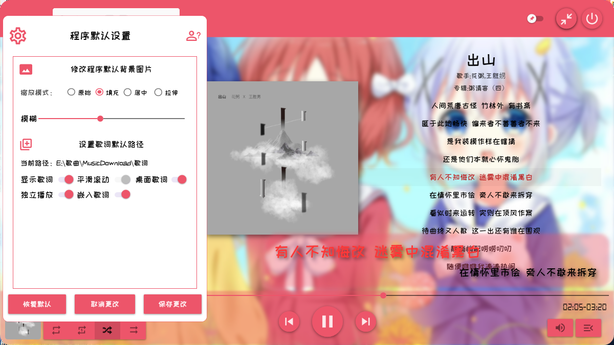
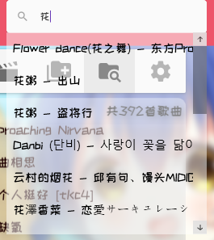

项目名称：WPF音乐播放器

介绍：

 一种本地化音乐播放器，基于NET4.7.2，使用MaterialDesignThemes开源控件库开发 

使用了taglib-sharp.dll来读取歌曲的标签信息，支持读取内嵌歌词，自动寻找单独歌词文件，和自动嵌入歌词，自动滚动歌词，歌词重新定位和桌面歌词，后期准备加入从网络获取歌词文件，可以扫描指定文件夹歌曲文件，并自动添加到播放目录，支持打开视频(.mp4;.wmv;.aiv)，音频(.mp3;.wav;.flac)可以选择播放模式(列表循环，单曲循环，随机播放，顺序播放)，歌单搜索，自动定位等等功能

如果遇到项目无法生成的情况，可以尝试卸载项目后重新加载

界面展示：

播放歌曲：

播放视频：

设置界面和桌面歌词：

搜索歌曲：

